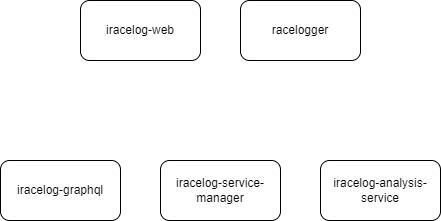

# iRacelog documentation

_work in progress_

## Current versions

List of current components versions
[]
[%header,format=dsv]
:===
Component:Version
racelogger: v0.7.0
iracelog-web: v0.18.3
iracelog-service-manager: v0.6.0
iracelog-analysis-service: v0.3.0
iracelog-graphql: v0.3.1
:===

## Components
.Components overview (png)

.Components overview (svg)
image::components.drawio.svg[]
### Racelogger

### iRacelog

## Credits
This application was inspired by https://timing71.org[timing71.org]. 

