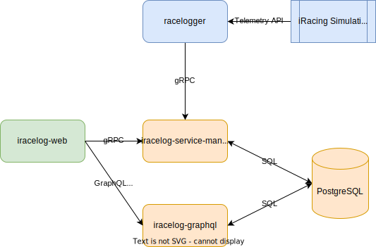

# iRacelog documentation

_work in progress_

## Current versions

List of current components

[%header,format=dsv]
:===
Component:Version
racelogger: v0.15.0
iracelog-web: v0.28.0
iracelog-service-manager-go: v0.21.0
iracelog-graphql: v0.4.0
iracelog-cli: v0.4.0
:===

## Components

.Components overview (svg)

### Racelogger
This module is responsible for extracting the data from the local running iRacing simulation software. 

_Racelogger_ is the data provider for the whole project. 

[%noheader,cols="1,2"]
|===
|Repository| https://github.com/mpapenbr/go-racelogger[racelogger]

|Language| Go

|Tech|   https://grpc.io/[gRPC]
|===

### iRacelog Web

This is the web frontend. It is used to show race data for both live and archived events. 

Repository: 

[%noheader,cols="1,2"]
|===
|Repository| https://github.com/mpapenbr/iracelog[iracelog]

|Language| TypeScript

|Tech|  https://reactjs.org/[React], https://ant.design[ant.design], 
|===

### iRacelog Service Manager (Go)

This module is the main entry point to manage the backend services. It recieves messages from the _racelogger_ and is responsible for the following tasks

* archive the recieved messages from the _racelogger_
* compute additional stats (such as stint durations, driver seat times, driver laps)
* database migration

[%noheader,cols="1,2"]
|===
|Repository| https://github.com/mpapenbr/iracelog-service-manager-go[iracelog-service-manager-go]

|Language| Go

|Tech|  https://grpc.io/[gRPC], https://buf.build/[buf.build], https://connectrpc.com/[ConnectRPC], https://opentelemetry.io/[OpenTelemetry], https://github.com/jackc/pgx/v5[Postgresql], https://github.com/golang-migrate/migrate[Migrate]
|===

### iRacelog CLI 

Command line tool used for administrative tasks which are not yet available via web frontend. 

This tool is also used for stress tests during development.

[%noheader,cols="1,2"]
|===
|Repository| https://github.com/mpapenbr/iracelog-cli[iracelog-cli]

|Language| Go

|Tech|  https://grpc.io/[gRPC], https://buf.build/[buf.build], https://connectrpc.com/[ConnectRPC]
|===

### iRacelog GraphQL

This component provides the search functionality for the _iRacelog_. 

[%noheader,cols="1,2"]
|===
|Repository| https://github.com/mpapenbr/iracelog-graphql[iracelog-graphql]

|Language| Go

|Tech| https://graphql.org/[GraphQL]
|===

## Components (retired)

[%header,format=dsv]
:===
Component:Version
iracelog-wamp-router: v0.0.2
racelogger (python): v0.8.0
iracelog-service-manager: v0.6.1
iracelog-analysis-service: v0.3.1
crossbar: v22.6.1
racelogctl: v0.4.0
:===

_iracelog-service-manager_ was replaced by the Go variant _iracelog-service-manager-go_

_iracelog-analysis-service_ was put out of order. Its tasks were integrated in _iracelog-service-manager-go_

_crossbar_ was replaced by the Go variant _iracelog-wamp-router_

_racelogger_ was replaced by the Go variant _go-racelogger_

_racelogctl_ was replaced by the gRPC variant _iracelog-cli_

_iracelog-wamp-router_ was no longer needed with the move from WAMP to gRPC

### iRacelog WAMP Router 

This module is the replacement for https://crossbar.io[Crossbar]. 

It serves as the central point for distributing messages between the components according to the WAMP specification.

While crossbar provides a lot of features we actually don't need much of them. The Nexus library in Go fullfills our needs and comes with a much smaller footprint.

[%noheader,cols="1,2"]
|===
|Repository| https://github.com/mpapenbr/iracelog-wamp-router[iracelog-wamp-router]

|Language| Go

|Tech|  https://wamp-proto.org/[WAMP], https://github.com/gammazero/nexus[Nexus]
|===

### Racelogger (Python)
This module is responsible for extracting the data from the local running iRacing simulation software. 
The _racelogger_ uses the python module https://github.com/kutu/pyirsdk[pyirsdk] to get access to the iRacing telemetry data. 
_Racelogger_ is the data provider for the whole project. 

[%noheader,cols="1,2"]
|===
|Repository| https://github.com/mpapenbr/python-racelogger[racelogger]

|Language| Python

|Tech|   https://github.com/kutu/pyirsdk[pyirsdk], https://wamp-proto.org/[WAMP], https://github.com/crossbario/autobahn-python[autobahn]
|===

### iRacelog Service Manager (Python)

This module is the main entry point to manage the backend services. It recieves messages from the _racelogger_ and is responsible for the distribution to other backend components, such as

* archive the recieved messages from the _racelogger_
* compute additional stats (such as stint durations, driver seat times, driver laps)
* gateway to linked subcomponents 

[%noheader,cols="1,2"]
|===
|Repository| https://github.com/mpapenbr/iracelog-service-manager[iracelog-service-manager]

|Language| Python

|Tech| https://crossbar.io/[crossbar], https://wamp-proto.org/[WAMP], https://github.com/crossbario/autobahn-python[autobahn]
|===

### iRacelog Anaylsis Service

This module is responsible for processing incoming WAMP-messages from the _racelogger_. During live events it holds the current race state (including extra computations) and stores it periodically into the database.

[%noheader,cols="1,2"]
|===
|Repository| https://github.com/mpapenbr/iracelog-analysis-service[iracelog-analysis-service]

|Language| TypeScript

|Tech| https://wamp-proto.org/[WAMP], https://github.com/crossbario/autobahn-js[autobahn]
|===

## Utilities

### racelogctl (CLI)

Command line tool used for administrative tasks which are not yet available via web frontend. 

This tool is also used for stress tests during development.

[%noheader,cols="1,2"]
|===
|Repository| https://github.com/mpapenbr/racelogctl[racelogctl]

|Language| Go

|Tech| https://github.com/spf13/cobra[Cobra], https://github.com/spf13/viper[Viper], https://wamp-proto.org/[WAMP], https://github.com/gammazero/nexus[Nexus]
|===

### Deployment 

This repository contains samples for deploying the application in the following environments

* docker via docker compose
* kubernetes via Helm charts

CAUTION: The samples in this repository are designed for local test environments. 

[%noheader,cols="1,2"]
|===
|Repository| https://github.com/mpapenbr/iracelog-deployment[iracelog-deployment]

|Tech| https://www.docker.com/[Docker], https://kubernetes.io/[Kubernetes], https://helm.sh/[Helm]
|===

### Sample installation 

This setup is supposed for users who are familar with Linux servers. The ansible playbooks can be used to setup the application on IaaS (Infrastructure as a Service) machines. 

The sample uses Hetzner (for IaaS) and Netcup (for domain services), but you may adjust the playbooks for other providers. 

[%noheader,cols="1,2"]
|===
|Repository| https://github.com/mpapenbr/iracelog-ansible-server-setup[sample-setup]

|Language| Ansible, Python
|Tech| https://www.docker.com/[Docker]
|===

## Credits
This application was inspired by https://timing71.org[timing71.org]. 

